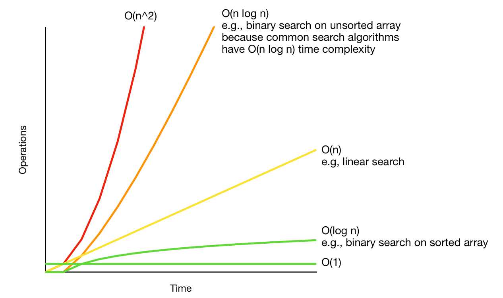

# Binary Search Notes ::-
* #### Most important Search which is asked in Google, Microsoft, etc
### When to use Binary Search?
* #### When given a sorted array try Binary Search first.
* #### sqrt of a number( here we working in sequnce of a number)


What is Binary Search?
* ### Array should be sorted.
````  
arr = [2, 4, 6, 9, 11, 12, 14, 20, 36, 48]
target = 36

1. find the middle element.

2. check if the
        ● target > middle ==> Search in right
        ● target < middle ==> Search in left

3. if the middle == target  ==> it is the answer

4. this will continue until element is found if not found then the elemnt is not exist.

5. if start > elment : element not found.
````
````
Better way to find middle value

* mid = (s + e)/2  --> for large start and end values this will exceed the int range

so, use this instead

** mid = s + (e - s)/2
````



### Why Binary Search?
````
Q. Find the max no. such comparisions in Worst Case.
````

* ### Order Agnostic Binary Search (Sorted in Acsending order or in Decsending order) :-
* How to find out that an array is Sorted in Acsending order or in Decsending order ?
````
arr = [3, 3, 4, 5, 6, 12, 14, 20, 33]

1. To find order check first and last element (s = 3, e = 33).
   if    s > e ==> decsending order
   else  s < e ==> Acsending order

````
